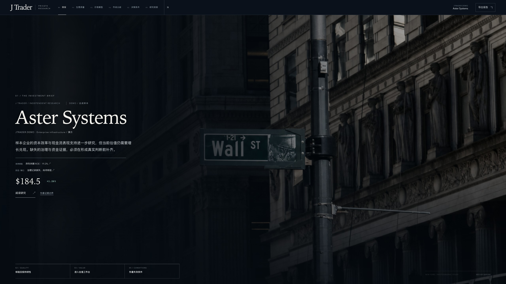
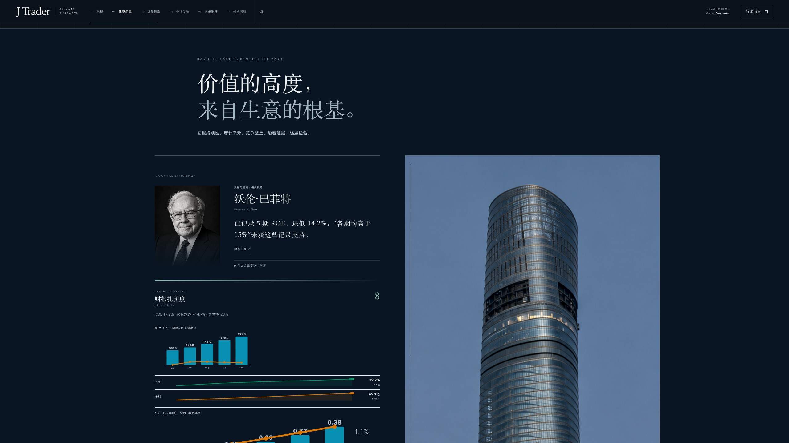
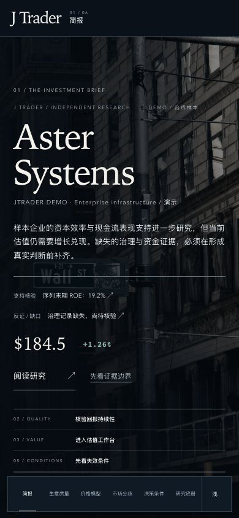

<div align="center">

# J Trader

### 给你的自选股，配个研究员。

把想研究的美股代码交给 J Trader。<br>
查财务、算估值、找风险，整理成一份可以保存的网页研报。

**开源 AI 美股研究助手**

[先试一只](#first-stock) · [看看研报](#report) · [安装](#install) · [更多用法](#workflows)

</div>



## 自选股加了不少，研究还没顾上？

刷到一家有意思的公司，先加自选。

真要研究，又得找财报、查同行、抄数据、算估值。浏览器开了一排，最初那个问题还在：这家公司，现在到底贵不贵？

J Trader 接下这部分准备工作。你给它一个股票代码，它调用公开数据和估值工具，整理经营表现、价格假设与风险，再交出一份网页研报。

从你一直想查、却还没顾上查的那只开始。

<a id="first-stock"></a>

## 先试一只

[安装](#install)后，让你的 agent 在项目目录读取 `AGENTS.md`，再发这段话：

```text
用 J Trader 研究 AAPL。
我想知道它怎么赚钱、现在贵不贵，以及看空它有哪些理由。
生成一份 HTML 研报，数据不够的地方标出来。
```

只想先看一份基础报告，也可以直接运行：

```bash
python run.py AAPL --depth medium --no-browser
```

终端会给出报告路径。深度研究还需要 agent 复核，单独运行一次 CLI 不等于完成整个深度流程。

> **J Trader 是产品名，aJay 是维护者。** 为避免破坏现有安装，仓库地址、插件 ID、命令前缀和 `AJAY_*` 环境变量暂时继续使用 `aJay-Skill` / `ajay`；这些是兼容标识，不再作为产品品牌展示。

## 先看看，这家公司到底怎么赚钱

收入靠什么撑着？利润涨了，现金流有没有跟上？负债会不会让经营变得吃力？

J Trader 把经营数据、现金流和资本效率放在一起分析。值得继续查的问题、缺失的资料，也会留在报告里。



## 贵不贵，把账摊开算

一个目标价，背后能藏下不少乐观假设。

J Trader 把现金流折现（DCF）、同行比较和敏感性分析放进同一份报告。折现率换个数，长期增长慢一点，估值会变多少？你可以查看模型呈现的不同情景，再判断自己认不认同这些假设。


## 看多的理由有了。看空的呢？

你可能看中了增长，有人却觉得价格太贵；你看好行业前景，有人更在意现金流。

美股研究可调用 **42 种投资方法视角**，从价值、成长、宏观、趋势、量化等方向检查同一家公司，整理各自支持、反对和暂时无法判断的地方。

读报告时，可以按流派筛选，也可以搜索自己关心的问题。

<sub>这些视角由算法 / AI 模拟，不是真实投资者参与或背书，也不等于 42 份独立证据。</sub>

<a id="report"></a>

## 查完了，给你一份能留下来的研报

报告在浏览器里打开。从公司概况往下读，接着看生意、估值、分歧和风险，最后查原始记录。也可以直接跳到你关心的章节。

想核对数据，打开证据记录。想下次接着研究，保存单文件 HTML 和研究输入。之后再次运行研究时，可以把新旧报告放在一起复盘。

报告支持搜索、流派筛选和移动端阅读，默认保存在本机，生成后的单文件报告可以离线查看。

<p align="center">
  
</p>

## 不用每次都做全套

刚发现一家公司，可以先快速扫描。喜欢它的业务、拿不准价格，就单独算估值。财报出来了，再检查原来的看法有没有需要修改的地方。

| 手头的问题 | 对应工作流 |
|---|---|
| 这只股票值得花时间细看吗？ | `/ajay:quick-scan AAPL` |
| 这个价格怎么算出来的？ | `/ajay:dcf MSFT` |
| 跟同行比，到底贵在哪儿？ | `/ajay:comps AMD` |
| 新财报改变了什么？ | `/ajay:earnings AAPL` |
| 认真研究一遍，留份完整报告。 | `/ajay:analyze-stock AAPL` |

这些是 Claude Code 命令。其他适配的 agent 环境可使用自然语言。股票代码仅用于演示，不代表推荐。

<a id="install"></a>

## 安装

需要 Git 与 Python 3.10+。完整深度研究还需要能读取项目文件、执行脚本并进行复核的 agent 环境。

### Claude Code

```text
/plugin marketplace add Aji-Q/aJay-Skill
/plugin install ajay@ajay-skill
/ajay:analyze-stock AAPL
```

### Codex

让 Codex 按以下地址的说明安装，再读取仓库根目录的 `AGENTS.md`：

```text
https://raw.githubusercontent.com/Aji-Q/aJay-Skill/main/.codex/INSTALL.md
```

随后在项目目录发出研究请求即可。详细步骤见 [.codex/INSTALL.md](.codex/INSTALL.md)。

### Python / CLI

以下是 macOS / Linux 的安装步骤：

```bash
git clone https://github.com/Aji-Q/aJay-Skill.git
cd aJay-Skill
python3 -m venv .venv
source .venv/bin/activate
python -m pip install -r requirements.txt
python run.py AAPL --depth medium --no-browser
```

在终端给出的目录里打开 `full-report-standalone.html`。

<details>
<summary><strong>Gemini CLI、OpenCode、Hermes 与其他环境</strong></summary>

### Gemini CLI

```bash
gemini extensions install https://github.com/Aji-Q/aJay-Skill
```

### OpenCode

按 [.opencode/INSTALL.md](.opencode/INSTALL.md) 安装。

### Hermes

克隆仓库后，在仓库根目录执行：

```bash
bash install-hermes.sh "$PWD"
```

完整说明见 [INSTALL-HERMES.md](INSTALL-HERMES.md)。其他环境的工作流入口见 [AGENTS.md](AGENTS.md)。

</details>

<details>
<summary><strong>先在本机看产品演示</strong></summary>

完成依赖安装后，从仓库根目录运行：

```bash
cd skills/deep-analysis/scripts
python preview_editorial.py
```

演示中的 Aster Systems / `JTRADER.DEMO` 为合成样本，不是真实证券或分析业绩。

</details>

<a id="workflows"></a>

## 更多用法

<details>
<summary><strong>查看全部 20 条工作流</strong></summary>

| 命令 | 用途 |
|---|---|
| `/ajay:analyze-stock AAPL` | 完整个股研究与最终报告 |
| `/ajay:quick-scan NVDA` | 核心数据与风险快速扫描 |
| `/ajay:dcf MSFT` | DCF、WACC、终值与敏感性分析 |
| `/ajay:comps AMD` | 同行估值、历史分位与隐含价格 |
| `/ajay:lbo DELL` | 杠杆收购可行性与 IRR 测试 |
| `/ajay:segmental-model AMZN` | 分业务收入、三情景与三年预测 |
| `/ajay:initiate META` | 首次覆盖报告 |
| `/ajay:ic-memo GOOGL` | 投资备忘录与三情景回报分析 |
| `/ajay:earnings AAPL` | 财报解读与投资逻辑影响 |
| `/ajay:earnings-preview NVDA` | 财报前共识、情景与隐含波动 |
| `/ajay:model-update MSFT` | 新财报或指引后的模型更新 |
| `/ajay:catalysts TSLA` | 已发生事件与未来催化剂 |
| `/ajay:thesis AMZN` | 投资逻辑复查与追踪 |
| `/ajay:dd COST` | 尽调工作流与清单 |
| `/ajay:screen AAPL` | 价值、成长、质量、GARP 与做空方向筛选 |
| `/ajay:ai-readiness ORCL` | AI 业务暴露、产业位置与关键因素分析 |
| `/ajay:panel-only AAPL` | 仅运行市场适配的方法评审 |
| `/ajay:scan-trap TICKER` | 异常宣传、资金与交易风险检查 |
| `/ajay:returns` | 组合收益与行业贡献归因 |
| `/ajay:rebalance` | 持仓漂移、交易清单与换手成本分析 |

各工作流的可用输出取决于市场、数据源、配置与输入。组合相关工作流需要你提供对应数据；“交易清单”指分析结果，不是自动下单。

</details>

<details>
<summary><strong>研究深度与 CLI 进阶</strong></summary>

| 深度 | 适合做什么 |
|---|---|
| `lite` | 快速了解核心数据和主要风险 |
| `medium` | 日常研究，默认档位 |
| `deep` | 建仓前或财报后的深入研究，需完成 agent 复核 |

```bash
python run.py AAPL --depth lite --no-browser
python run.py AAPL --depth medium --no-browser
python run.py AAPL --depth deep --no-browser
python run.py AAPL --school A --no-browser
python run.py --versus AAPL MSFT GOOGL
python run.py --portfolio holdings.csv
python run.py AAPL --from-modeling --no-browser
python run.py AAPL --output-dir ./output --no-browser
```

`deep` 先执行 Stage 1，再由 agent 读取本次输入、完成带输入指纹的复核，最后组装报告。具体流程见 [AGENTS.md](AGENTS.md)。实际耗时受模型、网络和数据覆盖影响。

确需建立外部访问入口时，可以显式运行：

```bash
python run.py AAPL --remote
```

远程模式会扩大报告的访问范围，使用前请检查私人信息。默认在本机阅读即可。

</details>

## 开始前，几个实际问题

<details>
<summary><strong>必须买数据服务吗？</strong></summary>

核心研究路径可以使用公开数据。SEC XBRL 和 yfinance 参与美股数据采集，FMP 共识数据、moomoo OpenD 等为可选增强。不同标的和网络环境的覆盖可能不同，缺失项会标记出来。AI 模型服务和可选数据服务可能另行收费。

</details>

<details>
<summary><strong>主要研究哪些市场？</strong></summary>

当前以美股个股为主。保留 A 股、港股兼容工作流，但各市场的数据覆盖和可用分析并不相同。

</details>

<details>
<summary><strong>能自动盯盘、下单吗？</strong></summary>

这里提供的是按需研究工作流。需要新结果时，重新运行对应分析；当前产品介绍不包含持续盯盘或自动交易服务。

</details>

<details>
<summary><strong>数据不够，或者 AI 看错了怎么办？</strong></summary>

报告保留数据来源、时间和缺口；缺失值不应被当成真实的零，计算结果与 AI 推理也需要区分。模型、数据和生成过程仍可能出错，重要数字与结论需要独立核验。方法视角的数量、评分或测试通过数都不代表投资准确率。

相关实现与检查记录见 [分析审计](docs/ANALYSIS-AUDIT.md) 和 [功能审核](docs/FUNCTIONAL-AUDIT.md)。

</details>

<details>
<summary><strong>报告放在本机，等于所有过程都在本地吗？</strong></summary>

不等于。生成的报告默认保存在本机，但研究过程可能调用外部数据接口和你所配置的 AI 服务。报告可保存和发送；分享前检查其中是否有不宜公开的信息。

</details>

## 开源与致谢

J Trader 由 **aJay（Aji-Q）** 维护。

项目派生自 MIT 许可的 stock-deep-analyzer 3.9.4，保留原作者版权与贡献记录。软件许可见 [LICENSE](LICENSE)，上游来源与第三方声明见 [NOTICE](NOTICE) 和 [OWNERSHIP.md](docs/OWNERSHIP.md)。摄影、图像与部分前端依赖适用各自许可，不因项目采用 MIT 而一并改变。

[版本记录](RELEASE-NOTES.md) · [反馈问题](https://github.com/Aji-Q/aJay-Skill/issues) · [贡献记录](docs/UPSTREAM-CONTRIBUTORS.md)

---

<div align="center">

### 自选股里总有一只，你一直想弄明白。

[从那只开始](#first-stock)

<sub>J Trader 是研究辅助工具，不构成投资建议，不承诺收益。请独立核验数据与结论。</sub>

</div>
